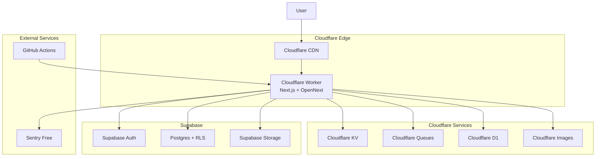
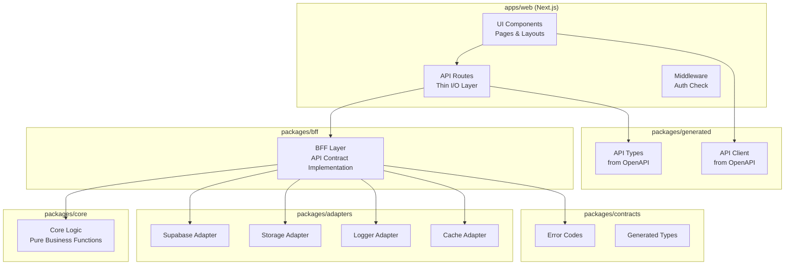

# 設計書

## 概要

Template Gamma は、Next.js 15.5.2 と React 19.0.0 を使用し、OpenNext で Cloudflare Workers 上に展開される Web アプリケーション開発用のプロジェクトテンプレートです。型安全性を重視した OpenAPI-First 開発、段階的な機能拡張、そして将来のバックエンド分離を見据えた設計を採用します。

### 設計原則

1. **契約駆動開発**: OpenAPI を単一の真実とし、型とクライアントを自動生成
2. **段階的拡張**: MVP-0（ヘルスチェック）→ MVP-1（認証 + 画像管理）→ 将来フェーズ
3. **層分離**: UI/BFF/Core の明確な境界と一方向依存
4. **観測性**: 構造化ログと効率的なモニタリング
5. **セキュリティファースト**: RLS、PII 保護、セッション管理

### Cloudflare Workers × OpenNext 前提条件

1. **OpenNext Adapter**: `@opennextjs/cloudflare` を使用（Node ランタイムのみ対応、Edge ランタイムは使用しない）
2. **ビルド経路**: `next build` → `@opennextjs/cloudflare build` → `.open-next/` → `wrangler preview/deploy`
3. **Compatibility**: `compatibility_date` 固定、`nodejs_compat` 有効化必須
4. **キャッシュ**: Next.js のデータ/ISR キャッシュは Workers KV バインディング `NEXT_CACHE_WORKERS_KV` を使用
5. **環境変数**: env バインディングを一次情報とし、必要に応じて process.env をフォールバック

## アーキテクチャ

### システム全体構成



### 論理層構成



### 2モード切替アーキテクチャ

```mermaid
graph LR
    subgraph "Monolith Mode"
        WebM[apps/web] --> BFFM[packages/bff]
        BFFM --> CoreM[packages/core]
    end

    subgraph "Service Mode"
        WebS[apps/web] --> ClientS[Generated Client]
        ClientS --> ExtService[External Service<br/>Hono/Go/Python]
        ExtService --> CoreS[packages/core]
    end

    EnvVar[BACKEND_MODE=monolith|service] --> WebM
    EnvVar --> WebS
```

## コンポーネントとインターフェース

### 1. フロントエンド（apps/web）

#### ページ構成

```typescript
// app/page.tsx - トップページ
export default function HomePage() {
  // 未認証: ログインボタン表示
  // 認証済み: ホームへリダイレクト
}

// app/home/page.tsx - ホーム（認証必須）
export default function AuthenticatedHome() {
  // ヘルスチェックボタン
  // 画像アップロード UI
  // 画像一覧表示
}

// app/health/page.tsx - SSR ヘルスチェック
export default function HealthPage() {
  // サーバーサイドでヘルスチェック実行
}
```

#### API Routes

```typescript
// app/api/healthz/route.ts - Liveness
export async function GET() {
  return Response.json({
    status: 'ok',
    timestamp: new Date().toISOString(),
  });
}

// app/api/readyz/route.ts - Readiness
export async function GET() {
  const healthResult = await bff.checkReadiness();
  return Response.json(healthResult);
}

// app/api/diag/route.ts - Diagnostics (認証必須)
export async function GET() {
  // 詳細診断情報
}

// app/api/auth/login/route.ts
export async function GET() {
  // Supabase OAuth リダイレクト
}

// app/api/auth/callback/route.ts
export async function GET() {
  // OAuth コールバック処理
}

// app/api/auth/logout/route.ts
export async function POST() {
  // セッション削除
}
```

#### Middleware

```typescript
// middleware.ts
export function middleware(request: NextRequest) {
  // 認証チェック
  // /home/* は認証必須
  // /api/diag は認証必須
  // TraceContext の継承・生成
}
```

### 2. BFF層（packages/bff）

```typescript
// packages/bff/health.ts
export interface HealthService {
  checkLiveness(): Promise<LivenessResult>;
  checkReadiness(): Promise<ReadinessResult>;
  checkDiagnostics(): Promise<DiagnosticsResult>;
}

export class HealthServiceImpl implements HealthService {
  constructor(
    private supabaseAdapter: SupabaseAdapter,
    private storageAdapter: StorageAdapter,
    private logger: Logger
  ) {}

  async checkReadiness(): Promise<ReadinessResult> {
    const checks = await Promise.allSettled([
      this.supabaseAdapter.ping(),
      this.storageAdapter.ping(),
    ]);

    return {
      status: this.determineStatus(checks),
      dependencies: this.formatDependencies(checks),
      version: process.env.APP_VERSION,
      commit: process.env.GIT_COMMIT,
      buildTime: process.env.BUILD_TIME,
    };
  }
}

// packages/bff/auth.ts
export interface AuthService {
  initiateLogin(provider: string): Promise<LoginResult>;
  handleCallback(code: string): Promise<CallbackResult>;
  logout(sessionId: string): Promise<void>;
  getCurrentUser(sessionId: string): Promise<User | null>;
}

// packages/bff/images.ts
export interface ImageService {
  uploadImage(userId: string, file: File): Promise<UploadResult>;
  listUserImages(userId: string, pagination: Pagination): Promise<ImageList>;
  deleteImage(userId: string, imageId: string): Promise<void>;
}
```

### 3. Core層（packages/core）

```typescript
// packages/core/user.ts
export interface User {
  id: string;
  createdAt: Date;
  updatedAt: Date;
  lastLoginAt: Date;
}

export function updateLastLogin(user: User): User {
  return {
    ...user,
    lastLoginAt: new Date(),
    updatedAt: new Date(),
  };
}

// packages/core/image.ts
export interface Image {
  id: string;
  userId: string;
  filename: string;
  status: 'uploading' | 'processing' | 'ready' | 'failed';
  createdAt: Date;
  updatedAt: Date;
}

export function validateImageUpload(file: File): ValidationResult {
  // ファイルサイズ、形式の検証
}

// packages/core/health.ts
export interface HealthCheck {
  name: string;
  status: 'ok' | 'degraded' | 'down';
  latency?: number;
  error?: string;
}

export function aggregateHealthStatus(
  checks: HealthCheck[]
): 'ok' | 'degraded' | 'down' {
  // ヘルスチェック結果の集約ロジック
}
```

### 4. Adapters（packages/adapters）

```typescript
// packages/adapters/supabase-server.ts
export class SupabaseServerAdapter {
  private client: SupabaseClient;

  constructor(url: string, serviceRoleKey: string) {
    this.client = createClient(url, serviceRoleKey);
  }

  async ping(): Promise<boolean> {
    try {
      const { error } = await this.client.from('_health').select('1').limit(1);
      return !error;
    } catch {
      return false;
    }
  }

  async createUser(user: Omit<User, 'createdAt' | 'updatedAt'>): Promise<User> {
    // RLS を考慮したユーザー作成
  }

  async updateLastLogin(userId: string): Promise<void> {
    // last_login_at の更新
  }
}

// packages/adapters/storage.ts
export interface StorageAdapter {
  uploadFile(bucket: string, path: string, file: File): Promise<string>;
  getSignedUrl(bucket: string, path: string): Promise<string>;
  deleteFile(bucket: string, path: string): Promise<void>;
  ping(): Promise<boolean>;
}

export class SupabaseStorageAdapter implements StorageAdapter {
  // Supabase Storage の実装
}

export class CloudflareImagesAdapter implements StorageAdapter {
  // 将来の Cloudflare Images 実装
}

// packages/adapters/logger.ts
export class WorkersLogger {
  constructor(private env: any) {}

  info(obj: any, msg?: string) {
    // Workers: 構造化 JSON を console.log で出力（Workers Logs/Logpush で収集）
    console.log(
      JSON.stringify(this.addTraceContext({ level: 'info', msg, ...obj }))
    );
  }

  error(obj: any, msg?: string) {
    console.error(
      JSON.stringify(this.addTraceContext({ level: 'error', msg, ...obj }))
    );
  }

  private addTraceContext(obj: any) {
    return {
      ...obj,
      requestId: this.getRequestId(),
      traceId: this.getTraceId(),
      service: 'template-gamma',
      env: this.env.NODE_ENV || process.env.NODE_ENV,
      version: this.env.APP_VERSION || process.env.APP_VERSION,
      timestamp: new Date().toISOString(),
    };
  }

  private getRequestId(): string {
    // TraceContext から requestId を取得
    return crypto.randomUUID();
  }

  private getTraceId(): string {
    // W3C TraceContext の traceparent ヘッダから traceId を抽出
    // 形式: 00-<trace-id>-<parent-id>-<trace-flags>
    return crypto.randomUUID().replace(/-/g, '').substring(0, 32);
  }
}

// 開発環境用（Node.js ローカル）
export class DevLogger {
  private logger: pino.Logger;

  constructor() {
    this.logger = pino({
      level: process.env.LOG_LEVEL || 'info',
      transport: { target: 'pino-pretty' }, // dev 専用
      redact: {
        paths: [
          'req.headers.authorization',
          'req.headers.cookie',
          'password',
          'token',
        ],
        censor: '[REDACTED]',
      },
    });
  }

  info(obj: any, msg?: string) {
    this.logger.info(obj, msg);
  }

  error(obj: any, msg?: string) {
    this.logger.error(obj, msg);
  }
}
```

## データモデル

### 1. Supabase テーブル設計

```sql
-- app_users テーブル
CREATE TABLE app_users (
  id UUID PRIMARY KEY DEFAULT auth.uid(),
  created_at TIMESTAMPTZ DEFAULT NOW(),
  updated_at TIMESTAMPTZ DEFAULT NOW(),
  last_login_at TIMESTAMPTZ DEFAULT NOW()
);

-- RLS ポリシー
ALTER TABLE app_users ENABLE ROW LEVEL SECURITY;

CREATE POLICY "Users can view own record" ON app_users
  FOR SELECT USING (auth.uid() = id);

CREATE POLICY "Users can update own record" ON app_users
  FOR UPDATE USING (auth.uid() = id);

-- updated_at 自動更新トリガー
CREATE OR REPLACE FUNCTION update_updated_at_column()
RETURNS TRIGGER AS $$
BEGIN
  NEW.updated_at = NOW();
  RETURN NEW;
END;
$$ language 'plpgsql';

CREATE TRIGGER update_app_users_updated_at
  BEFORE UPDATE ON app_users
  FOR EACH ROW EXECUTE FUNCTION update_updated_at_column();

-- images テーブル
CREATE TABLE images (
  id UUID PRIMARY KEY DEFAULT gen_random_uuid(),
  user_id UUID NOT NULL REFERENCES app_users(id) ON DELETE CASCADE,
  filename TEXT NOT NULL,
  storage_path TEXT NOT NULL,
  status TEXT NOT NULL CHECK (status IN ('uploading', 'processing', 'ready', 'failed')),
  file_size INTEGER,
  mime_type TEXT,
  created_at TIMESTAMPTZ DEFAULT NOW(),
  updated_at TIMESTAMPTZ DEFAULT NOW()
);

-- RLS ポリシー
ALTER TABLE images ENABLE ROW LEVEL SECURITY;

CREATE POLICY "Users can view own images" ON images
  FOR SELECT USING (auth.uid() = user_id);

CREATE POLICY "Users can insert own images" ON images
  FOR INSERT WITH CHECK (auth.uid() = user_id);

CREATE POLICY "Users can update own images" ON images
  FOR UPDATE USING (auth.uid() = user_id);

CREATE POLICY "Users can delete own images" ON images
  FOR DELETE USING (auth.uid() = user_id);

-- インデックス
CREATE INDEX idx_images_user_id_created_at ON images(user_id, created_at DESC);
```

### 2. Supabase Storage 設計

```typescript
// Storage バケット設定
const BUCKETS = {
  USER_IMAGES: 'user-images',
} as const;

// ストレージパス設計（userId をフォルダ名に含める）
const getImagePath = (userId: string, imageId: string, filename: string) =>
  `${userId}/${imageId}/${filename}`;
```

```sql
-- RLS ポリシー（Storage）実運用版
-- アップロード権限（INSERT）
CREATE POLICY "Users can upload own images" ON storage.objects
  FOR INSERT TO authenticated
  WITH CHECK (
    bucket_id = 'user-images' AND
    auth.uid()::text = (storage.foldername(name))[1]
  );

-- 読み取り権限（SELECT）- 署名URL生成に必要
CREATE POLICY "Users can read own images" ON storage.objects
  FOR SELECT TO authenticated
  USING (
    bucket_id = 'user-images' AND
    auth.uid()::text = (storage.foldername(name))[1]
  );

-- 更新権限（UPDATE）- 上書き/upsert に必要
CREATE POLICY "Users can update own images" ON storage.objects
  FOR UPDATE TO authenticated
  USING (
    bucket_id = 'user-images' AND
    auth.uid()::text = (storage.foldername(name))[1]
  );

-- 削除権限（DELETE）
CREATE POLICY "Users can delete own images" ON storage.objects
  FOR DELETE TO authenticated
  USING (
    bucket_id = 'user-images' AND
    auth.uid()::text = (storage.foldername(name))[1]
  );
```

**注意**: `app_users.id DEFAULT auth.uid()` は JWT なしの直 SQL（シード/管理バッチ）では `NULL` になり失敗します。アプリ経由 Insert のみ許可するか、seed 時は明示的に ID を渡す方針を採用してください。

### 3. OpenAPI スキーマ設計

```yaml
# openapi/openapi.yaml
openapi: 3.0.3
info:
  title: Template Gamma API
  version: 1.0.0

paths:
  /api/healthz:
    get:
      summary: Liveness check
      responses:
        '200':
          description: Service is alive
          content:
            application/json:
              schema:
                $ref: '#/components/schemas/LivenessResponse'

  /api/readyz:
    get:
      summary: Readiness check
      responses:
        '200':
          description: Service is ready
          content:
            application/json:
              schema:
                $ref: '#/components/schemas/ReadinessResponse'

  /api/diag:
    get:
      summary: Diagnostics (auth required)
      security:
        - cookieAuth: []
      responses:
        '200':
          description: Diagnostic information
          content:
            application/json:
              schema:
                $ref: '#/components/schemas/DiagnosticsResponse'

  /api/images:
    get:
      summary: List user images
      security:
        - cookieAuth: []
      parameters:
        - name: page
          in: query
          schema:
            type: integer
            default: 1
        - name: limit
          in: query
          schema:
            type: integer
            default: 20
      responses:
        '200':
          description: Image list
          content:
            application/json:
              schema:
                $ref: '#/components/schemas/ImageListResponse'

    post:
      summary: Upload image
      security:
        - cookieAuth: []
      requestBody:
        content:
          multipart/form-data:
            schema:
              type: object
              properties:
                file:
                  type: string
                  format: binary
      responses:
        '201':
          description: Image uploaded
          content:
            application/json:
              schema:
                $ref: '#/components/schemas/ImageResponse'

components:
  schemas:
    LivenessResponse:
      type: object
      required:
        - status
        - timestamp
      properties:
        status:
          type: string
          enum: [ok]
        timestamp:
          type: string
          format: date-time

    ReadinessResponse:
      type: object
      required:
        - status
        - dependencies
        - version
        - commit
        - buildTime
      properties:
        status:
          type: string
          enum: [ok, degraded, down]
        dependencies:
          type: array
          items:
            $ref: '#/components/schemas/HealthCheck'
        version:
          type: string
        commit:
          type: string
        buildTime:
          type: string

    HealthCheck:
      type: object
      required:
        - name
        - status
      properties:
        name:
          type: string
        status:
          type: string
          enum: [ok, degraded, down]
        latency:
          type: number
        error:
          type: string

    ImageResponse:
      type: object
      required:
        - id
        - filename
        - status
        - createdAt
      properties:
        id:
          type: string
          format: uuid
        filename:
          type: string
        status:
          type: string
          enum: [uploading, processing, ready, failed]
        createdAt:
          type: string
          format: date-time

    ImageListResponse:
      type: object
      required:
        - images
        - pagination
      properties:
        images:
          type: array
          items:
            $ref: '#/components/schemas/ImageResponse'
        pagination:
          $ref: '#/components/schemas/Pagination'

    Pagination:
      type: object
      required:
        - page
        - limit
        - total
        - hasNext
      properties:
        page:
          type: integer
        limit:
          type: integer
        total:
          type: integer
        hasNext:
          type: boolean

    ErrorResponse:
      type: object
      required:
        - code
        - message
      properties:
        code:
          type: string
        message:
          type: string
        details:
          type: object

  securitySchemes:
    cookieAuth:
      type: apiKey
      in: cookie
      name: sb-access-token
```

## エラーハンドリング

### 1. エラーコード体系

```typescript
// packages/contracts/error-codes.ts
export const ERROR_CODES = {
  // 認証関連
  AUTH_REQUIRED: 'AUTH_REQUIRED',
  AUTH_INVALID_TOKEN: 'AUTH_INVALID_TOKEN',
  AUTH_EXPIRED: 'AUTH_EXPIRED',

  // 認可関連
  FORBIDDEN: 'FORBIDDEN',
  RESOURCE_NOT_FOUND: 'RESOURCE_NOT_FOUND',

  // バリデーション関連
  VALIDATION_ERROR: 'VALIDATION_ERROR',
  FILE_TOO_LARGE: 'FILE_TOO_LARGE',
  UNSUPPORTED_FILE_TYPE: 'UNSUPPORTED_FILE_TYPE',

  // システム関連
  INTERNAL_ERROR: 'INTERNAL_ERROR',
  SERVICE_UNAVAILABLE: 'SERVICE_UNAVAILABLE',
  RATE_LIMIT_EXCEEDED: 'RATE_LIMIT_EXCEEDED',
} as const;

export type ErrorCode = (typeof ERROR_CODES)[keyof typeof ERROR_CODES];

export interface ApiError {
  code: ErrorCode;
  message: string;
  details?: Record<string, any>;
}
```

### 2. エラーハンドリング実装

```typescript
// packages/bff/error-handler.ts
export class ApiErrorHandler {
  static handle(error: unknown): Response {
    const logger = new PinoLogger();

    if (error instanceof ValidationError) {
      return this.createErrorResponse(422, {
        code: ERROR_CODES.VALIDATION_ERROR,
        message: 'Validation failed',
        details: error.details,
      });
    }

    if (error instanceof AuthError) {
      return this.createErrorResponse(401, {
        code: ERROR_CODES.AUTH_REQUIRED,
        message: 'Authentication required',
      });
    }

    // 予期しないエラー
    logger.error({ err: error }, 'Unhandled error');
    return this.createErrorResponse(500, {
      code: ERROR_CODES.INTERNAL_ERROR,
      message: 'Internal server error',
    });
  }

  private static createErrorResponse(
    status: number,
    error: ApiError
  ): Response {
    return Response.json(error, { status });
  }
}
```

## 運用・デプロイ設定

### 1. Wrangler 設定

```json
// wrangler.jsonc
{
  "$schema": "node_modules/wrangler/config-schema.json",
  "name": "template-gamma",
  "main": ".open-next/worker.js",
  "assets": {
    "directory": ".open-next/assets",
    "binding": "ASSETS"
  },
  "compatibility_date": "2025-09-23",
  "compatibility_flags": [
    "nodejs_compat",
    "nodejs_compat_populate_process_env"
  ],
  "kv_namespaces": [
    {
      "binding": "NEXT_CACHE_WORKERS_KV",
      "id": "your-kv-namespace-id",
      "preview_id": "your-preview-kv-namespace-id"
    }
  ],
  "vars": {
    "NODE_ENV": "production",
    "BACKEND_MODE": "monolith"
  }
}
```

### 2. 環境変数管理

```bash
# .dev.vars（ローカル開発用）
SUPABASE_URL=your-supabase-url
SUPABASE_ANON_KEY=your-anon-key
SUPABASE_SERVICE_ROLE_KEY=your-service-role-key
SENTRY_DSN=your-sentry-dsn
LOG_LEVEL=debug
BACKEND_MODE=monolith
```

```bash
# Secrets 管理（本番用）
wrangler secret put SUPABASE_SERVICE_ROLE_KEY
wrangler secret put SENTRY_DSN
```

### 3. Sentry 設定（Cloudflare Workers 版）

```typescript
// packages/adapters/sentry.ts
import * as Sentry from '@sentry/cloudflare';

export function initSentry(env: any) {
  Sentry.init({
    dsn: env.SENTRY_DSN,
    tracesSampleRate: 0, // エラー収集のみ、APM は無効
    release: env.APP_VERSION,
    environment: env.NODE_ENV,
    beforeSend(event) {
      // PII 除去
      if (event.request?.headers) {
        delete event.request.headers['authorization'];
        delete event.request.headers['cookie'];
      }
      return event;
    },
  });
}
```

### 4. ビルド・デプロイ手順

```bash
# 1. Next.js ビルド
npm run build

# 2. OpenNext Cloudflare アダプタでビルド
npx @opennextjs/cloudflare build

# 3. ローカルプレビュー（Workers 実行互換テスト）
wrangler preview

# 4. デプロイ
wrangler deploy
```

### 5. TraceContext 実装

```typescript
// packages/adapters/trace-context.ts
export class TraceContext {
  static parseTraceparent(traceparent?: string): {
    traceId: string;
    spanId: string;
  } {
    if (!traceparent) {
      return {
        traceId: crypto.randomUUID().replace(/-/g, '').substring(0, 32),
        spanId: crypto.randomUUID().replace(/-/g, '').substring(0, 16),
      };
    }

    // W3C TraceContext 形式: 00-<trace-id>-<parent-id>-<trace-flags>
    const parts = traceparent.split('-');
    if (parts.length === 4) {
      return {
        traceId: parts[1],
        spanId: parts[2],
      };
    }

    // フォールバック
    return {
      traceId: crypto.randomUUID().replace(/-/g, '').substring(0, 32),
      spanId: crypto.randomUUID().replace(/-/g, '').substring(0, 16),
    };
  }

  static generateTraceparent(traceId: string, spanId: string): string {
    return `00-${traceId}-${spanId}-01`;
  }
}
```

## テスト戦略

### 1. テスト構成

```typescript
// テスト構成
├── __tests__/
│   ├── unit/           # 単体テスト
│   │   ├── core/       # Core 層のテスト
│   │   ├── bff/        # BFF 層のテスト
│   │   └── adapters/   # Adapter のテスト
│   ├── integration/    # 統合テスト
│   │   ├── api/        # API エンドポイントテスト
│   │   └── auth/       # 認証フローテスト
│   └── e2e/           # E2E テスト
│       ├── health.spec.ts
│       └── auth-flow.spec.ts
```

### 2. テスト実装例

```typescript
// __tests__/unit/core/health.test.ts
import { describe, it, expect } from 'vitest';
import { aggregateHealthStatus } from '../../../packages/core/health';

describe('aggregateHealthStatus', () => {
  it('should return ok when all checks are ok', () => {
    const checks = [
      { name: 'db', status: 'ok' as const },
      { name: 'storage', status: 'ok' as const },
    ];

    expect(aggregateHealthStatus(checks)).toBe('ok');
  });

  it('should return degraded when some checks are degraded', () => {
    const checks = [
      { name: 'db', status: 'ok' as const },
      { name: 'storage', status: 'degraded' as const },
    ];

    expect(aggregateHealthStatus(checks)).toBe('degraded');
  });
});

// __tests__/integration/api/health.test.ts
import { describe, it, expect } from 'vitest';
import { testClient } from '../../utils/test-client';

describe('/api/readyz', () => {
  it('should return readiness status', async () => {
    const response = await testClient.get('/api/readyz');

    expect(response.status).toBe(200);
    expect(response.body).toMatchObject({
      status: expect.stringMatching(/^(ok|degraded|down)$/),
      dependencies: expect.arrayContaining([
        expect.objectContaining({
          name: expect.any(String),
          status: expect.stringMatching(/^(ok|degraded|down)$/),
        }),
      ]),
      version: expect.any(String),
      commit: expect.any(String),
      buildTime: expect.any(String),
    });
  });
});

// __tests__/e2e/auth-flow.spec.ts
import { test, expect } from '@playwright/test';

test('complete auth flow', async ({ page }) => {
  // トップページ
  await page.goto('/');
  await expect(page.getByRole('button', { name: 'ログイン' })).toBeVisible();

  // ログイン（認証セッション再利用パターン）
  await page.getByRole('button', { name: 'ログイン' }).click();
  // OAuth フローをモック（Playwright の認証セッション再利用を活用）

  // ホームページ
  await expect(page).toHaveURL('/home');
  await expect(page.getByText('ヘルスチェック実行')).toBeVisible();

  // ヘルスチェック実行
  await page.getByRole('button', { name: 'ヘルスチェック実行' }).click();
  await expect(page.getByText(/Status: (ok|degraded|down)/)).toBeVisible();

  // ログアウト
  await page.getByRole('button', { name: 'ログアウト' }).click();
  await expect(page).toHaveURL('/');
});

// 認証セッション再利用の設定例
// playwright.config.ts
export default defineConfig({
  projects: [
    {
      name: 'setup',
      testMatch: /.*\.setup\.ts/,
    },
    {
      name: 'chromium',
      use: {
        ...devices['Desktop Chrome'],
        storageState: 'playwright/.auth/user.json',
      },
      dependencies: ['setup'],
    },
  ],
});
```

### 3. モック戦略

```typescript
// __tests__/utils/mocks.ts
import { vi } from 'vitest';

export const mockSupabaseAdapter = {
  ping: vi.fn().mockResolvedValue(true),
  createUser: vi.fn(),
  updateLastLogin: vi.fn(),
  getCurrentUser: vi.fn(),
};

export const mockStorageAdapter = {
  ping: vi.fn().mockResolvedValue(true),
  uploadFile: vi.fn(),
  getSignedUrl: vi.fn(),
  deleteFile: vi.fn(),
};

// MSW v2 を使用した API モック（Next.js 15 対応）
import { setupServer } from 'msw/node';
import { http, HttpResponse } from 'msw';

export const server = setupServer(
  http.get('/api/readyz', () => {
    return HttpResponse.json({
      status: 'ok',
      dependencies: [
        { name: 'supabase', status: 'ok' },
        { name: 'storage', status: 'ok' },
      ],
      version: '1.0.0',
      commit: 'abc123',
      buildTime: '2024-01-01T00:00:00Z',
    });
  }),

  // Supabase Auth モック
  http.post('https://your-project.supabase.co/auth/v1/token', () => {
    return HttpResponse.json({
      access_token: 'mock-access-token',
      refresh_token: 'mock-refresh-token',
      user: { id: 'mock-user-id', email: 'test@example.com' },
    });
  })
);

// Next.js 15 + MSW v2 の設定
// vitest.config.ts
export default defineConfig({
  test: {
    setupFiles: ['./test/setup.ts'],
    environment: 'jsdom',
  },
});

// test/setup.ts
import { beforeAll, afterEach, afterAll } from 'vitest';
import { server } from './mocks/server';

beforeAll(() => server.listen());
afterEach(() => server.resetHandlers());
afterAll(() => server.close());
```

この設計書では、要件定義書で定義された全ての機能要件を満たす具体的な実装方針を示しました。次に、この設計に基づいた実装タスクリストの作成に進みます。

<function_calls>
<invoke name="userInput">
<parameter name="question">**設計書の内容はいかがでしょうか？アーキテクチャ、コンポーネント設計、データモデル、エラーハンドリング、テスト戦略など、実装に必要な設計要素を網羅できていますでしょうか？修正点があれば教えてください。**
