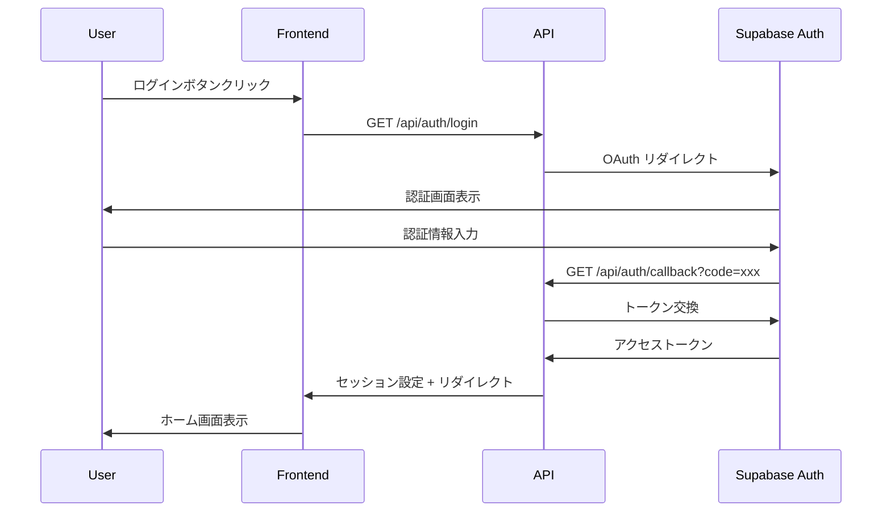

# API仕様書

## 概要

Template GammaのAPI仕様について説明します。OpenAPI 3.0.3に準拠した契約駆動開発を採用し、型安全性とフロントエンド・バックエンド間の整合性を保証しています。

## API設計原則

### 1. 契約駆動開発（Contract-First）

- OpenAPI仕様書を単一の真実として管理
- 仕様書から型定義とクライアントを自動生成
- Breaking Changeの自動検出

### 2. RESTful設計

- HTTPメソッドの適切な使用
- リソース指向のURL設計
- ステータスコードの統一

### 3. エラーハンドリング

- 統一されたエラーレスポンス形式
- エラーコードの体系化
- 詳細なエラー情報の提供

### 4. セキュリティ

- 認証が必要なエンドポイントの明確化
- CSRF対策
- 入力値検証

## OpenAPI仕様書

### 仕様書の場所

- **ファイル**: `openapi/openapi.yaml`
- **生成物**: `packages/generated/`
  - `api-types.ts`: TypeScript型定義
  - `api-client.ts`: APIクライアント
  - `api-client.schemas.ts`: Zodスキーマ

### 型生成コマンド

```bash
# 型とクライアントの生成
pnpm openapi:generate

# OpenAPI仕様書のLint
pnpm openapi:lint

# 生成物の同期チェック
pnpm openapi:check
```

## エンドポイント一覧

### ヘルスチェック系

#### GET /api/healthz（Liveness Probe）

**概要**: サービスの生存確認

**認証**: 不要

**レスポンス**:

```json
{
  "status": "ok",
  "timestamp": "2024-01-01T00:00:00.000Z"
}
```

**用途**:

- ロードバランサーのヘルスチェック
- 基本的な稼働確認
- 外部依存なしの軽量チェック

#### GET /api/readyz（Readiness Probe）

**概要**: サービスの準備状態確認

**認証**: 不要

**レスポンス**:

```json
{
  "status": "ok",
  "dependencies": [
    {
      "name": "supabase",
      "status": "ok",
      "latency": 45
    },
    {
      "name": "storage",
      "status": "ok",
      "latency": 23
    }
  ],
  "version": "1.0.0",
  "commit": "abc123def",
  "buildTime": "2024-01-01T00:00:00.000Z"
}
```

**ステータス値**:

- `ok`: 全ての依存関係が正常
- `degraded`: 一部の依存関係に問題
- `down`: 重要な依存関係が停止

#### GET /api/diag（Diagnostics）

**概要**: 詳細な診断情報

**認証**: 必須

**レスポンス**:

```json
{
  "status": "ok",
  "dependencies": [
    {
      "name": "supabase",
      "status": "ok",
      "latency": 45
    },
    {
      "name": "storage",
      "status": "ok",
      "latency": 32
    }
  ],
  "version": "1.0.0",
  "commit": "unknown",
  "buildTime": "2024-01-01T00:00:00.000Z",
  "timestamp": "2024-01-01T00:00:00.000Z",
  "details": {
    "uptime": 3600,
    "memory": {
      "used": 47185920,
      "total": 134217728
    },
    "environment": "production"
  }
}
```

### 認証系

#### GET /api/auth/login

**概要**: OAuth認証の開始

**認証**: 不要

**パラメータ**:

- `provider` (query): OAuth プロバイダー（デフォルト: google）
- `redirectTo` (query): 認証後のリダイレクト先

**レスポンス**: Supabase AuthのOAuthエンドポイントにリダイレクト

#### GET /api/auth/callback

**概要**: OAuth認証のコールバック処理

**認証**: 不要（OAuth フロー中）

**パラメータ**:

- `code` (query): OAuth認証コード
- `state` (query): CSRF対策用ステート

**レスポンス**: セッション設定後、`/home`にリダイレクト

#### POST /api/auth/logout

**概要**: ログアウト処理

**認証**: 必須

**レスポンス**:

```json
{
  "success": true,
  "message": "Logged out successfully"
}
```

### 画像管理系

#### GET /api/images

**概要**: ユーザーの画像一覧取得

**認証**: 必須

**パラメータ**:

- `page` (query): ページ番号（デフォルト: 1）
- `limit` (query): 1ページあたりの件数（デフォルト: 20、最大: 100）
- `status` (query): ステータスフィルター（optional）

**レスポンス**:

```json
{
  "images": [
    {
      "id": "550e8400-e29b-41d4-a716-446655440000",
      "filename": "example.jpg",
      "status": "ready",
      "fileSize": 1024000,
      "mimeType": "image/jpeg",
      "createdAt": "2024-01-01T00:00:00.000Z",
      "updatedAt": "2024-01-01T00:00:00.000Z"
    }
  ],
  "pagination": {
    "page": 1,
    "limit": 20,
    "total": 45,
    "hasNext": true
  }
}
```

#### POST /api/images

**概要**: 画像のアップロード

**認証**: 必須

**リクエスト**: `multipart/form-data`

```
Content-Type: multipart/form-data

file: (binary data)
```

**制限**:

- ファイルサイズ: 最大10MB
- ファイル形式: JPEG, PNG, WebP
- 同時アップロード: 1ファイル

**レスポンス**:

```json
{
  "id": "550e8400-e29b-41d4-a716-446655440000",
  "filename": "example.jpg",
  "status": "uploading",
  "fileSize": 1024000,
  "mimeType": "image/jpeg",
  "createdAt": "2024-01-01T00:00:00.000Z"
}
```

#### DELETE /api/images/[id]

**概要**: 画像の削除

**認証**: 必須

**パラメータ**:

- `id` (path): 画像ID（UUID）

**レスポンス**:

```json
{
  "success": true,
  "message": "Image deleted successfully"
}
```

## エラーハンドリング

### エラーレスポンス形式

全てのエラーは以下の統一形式で返却されます：

```json
{
  "code": "ERROR_CODE",
  "message": "Human readable error message",
  "details": {
    "field": "Additional error details"
  }
}
```

### エラーコード一覧

#### 認証・認可エラー（4xx）

| コード               | HTTPステータス | 説明                   |
| -------------------- | -------------- | ---------------------- |
| `AUTH_REQUIRED`      | 401            | 認証が必要             |
| `AUTH_INVALID_TOKEN` | 401            | 無効なトークン         |
| `AUTH_EXPIRED`       | 401            | トークンの有効期限切れ |
| `FORBIDDEN`          | 403            | アクセス権限なし       |
| `RESOURCE_NOT_FOUND` | 404            | リソースが見つからない |

#### バリデーションエラー（422）

| コード                  | HTTPステータス | 説明                             |
| ----------------------- | -------------- | -------------------------------- |
| `VALIDATION_ERROR`      | 422            | 入力値検証エラー                 |
| `FILE_TOO_LARGE`        | 422            | ファイルサイズ超過               |
| `UNSUPPORTED_FILE_TYPE` | 422            | サポートされていないファイル形式 |

#### システムエラー（5xx）

| コード                | HTTPステータス | 説明               |
| --------------------- | -------------- | ------------------ |
| `INTERNAL_ERROR`      | 500            | 内部サーバーエラー |
| `SERVICE_UNAVAILABLE` | 503            | サービス利用不可   |
| `RATE_LIMIT_EXCEEDED` | 429            | レート制限超過     |

### バリデーションエラーの詳細

Zodによる入力値検証でエラーが発生した場合：

```json
{
  "code": "VALIDATION_ERROR",
  "message": "Validation failed",
  "details": {
    "issues": [
      {
        "path": ["file"],
        "message": "File is required",
        "code": "invalid_type"
      }
    ]
  }
}
```

## 認証フロー

### OAuth認証フロー



### セッション管理

- **Cookie名**: `sb-access-token`
- **属性**: `HttpOnly`, `Secure`, `SameSite=Lax`
- **有効期限**: 1時間（自動更新）
- **更新**: リフレッシュトークンによる自動更新

### 認証チェック

```typescript
// middleware.ts での認証チェック
export function middleware(request: NextRequest) {
  const token = request.cookies.get('sb-access-token');

  if (!token && isProtectedPath(request.nextUrl.pathname)) {
    return NextResponse.redirect(new URL('/auth/login', request.url));
  }

  return NextResponse.next();
}
```

## APIクライアントの使用方法

### 自動生成されたクライアント

```typescript
// packages/generated/api-client.ts から自動生成
import { createApiClient } from '@/packages/generated/api-client';

const apiClient = createApiClient({
  baseURL: process.env.NEXT_PUBLIC_API_URL || '',
});

// 画像一覧の取得
const { data: images } = await apiClient.getImages({
  page: 1,
  limit: 20,
});

// 画像のアップロード
const { data: uploadResult } = await apiClient.uploadImage({
  file: selectedFile,
});
```

### エラーハンドリング

```typescript
try {
  const result = await apiClient.getImages();
  return result.data;
} catch (error) {
  if (error.response?.status === 401) {
    // 認証エラー
    router.push('/auth/login');
  } else if (error.response?.status === 422) {
    // バリデーションエラー
    const errorData = error.response.data;
    console.error('Validation error:', errorData.details);
  } else {
    // その他のエラー
    console.error('API error:', error);
  }
}
```

## レート制限

### 制限値

| エンドポイント       | 制限   | 期間 |
| -------------------- | ------ | ---- |
| `/api/auth/*`        | 10回   | 1分  |
| `/api/images` (POST) | 5回    | 1分  |
| `/api/images` (GET)  | 100回  | 1分  |
| その他               | 1000回 | 1分  |

### レート制限ヘッダー

```http
X-RateLimit-Limit: 100
X-RateLimit-Remaining: 95
X-RateLimit-Reset: 1640995200
```

## CORS設定

### 許可されたオリジン

- 開発環境: `http://localhost:3000`
- ステージング: `https://staging.template-gamma.com`
- 本番環境: `https://template-gamma.com`

### 許可されたメソッド

- `GET`, `POST`, `PUT`, `DELETE`, `OPTIONS`

### 許可されたヘッダー

- `Content-Type`
- `Authorization`
- `X-Requested-With`

## セキュリティ

### CSRF対策

- SameSite Cookieの使用
- Originヘッダーの検証
- CSRFトークンの実装（将来）

### 入力値検証

```typescript
// Zodスキーマによる検証
const uploadImageSchema = z.object({
  file: z
    .instanceof(File)
    .refine((file) => file.size <= 10 * 1024 * 1024, {
      message: 'File size must be less than 10MB',
    })
    .refine(
      (file) => ['image/jpeg', 'image/png', 'image/webp'].includes(file.type),
      {
        message: 'File must be JPEG, PNG, or WebP',
      }
    ),
});
```

### セキュリティヘッダー

```http
Content-Security-Policy: default-src 'self'
X-Frame-Options: DENY
X-Content-Type-Options: nosniff
Referrer-Policy: strict-origin-when-cross-origin
```

## パフォーマンス

### 目標値

- **API レスポンス時間**: p95 < 300ms
- **ファイルアップロード**: 10MB < 30秒
- **画像一覧取得**: < 100ms

### キャッシュ戦略

- **静的レスポンス**: CDNキャッシュ（24時間）
- **動的レスポンス**: キャッシュなし
- **画像ファイル**: CDNキャッシュ（7日間）

## 監視・ログ

### APIメトリクス

- リクエスト数
- レスポンス時間
- エラー率
- ステータスコード分布

### ログ形式

```json
{
  "level": "info",
  "msg": "API request completed",
  "method": "GET",
  "path": "/api/images",
  "status": 200,
  "duration": 45,
  "requestId": "req-123",
  "traceId": "trace-456",
  "userId": "user-789",
  "timestamp": "2024-01-01T00:00:00.000Z"
}
```

## 今後の拡張予定

### v2.0での追加予定

1. **GraphQL API**
   - より柔軟なデータ取得
   - リアルタイム更新

2. **WebSocket API**
   - リアルタイム通知
   - ライブアップデート

3. **バッチAPI**
   - 複数画像の一括処理
   - バックグラウンド処理

4. **Webhook API**
   - 外部システム連携
   - イベント通知

### セキュリティ強化

1. **OAuth 2.0 PKCE**
2. **API キー認証**
3. **IP制限**
4. **監査ログ**

## まとめ

Template GammaのAPIは以下の特徴を持ちます：

- **型安全性**: OpenAPI-First開発による契約保証
- **統一性**: 一貫したエラーハンドリングとレスポンス形式
- **セキュリティ**: 認証・認可・入力値検証の実装
- **パフォーマンス**: 効率的なキャッシュとレート制限
- **観測性**: 構造化ログと詳細なメトリクス
- **拡張性**: 将来の機能追加を見据えた設計

適切なAPI設計により、フロントエンドとバックエンドの効率的な開発と保守が可能になります。
