# システムアーキテクチャ設計書

## 概要

Template Gammaは、Next.js 15.5.2とReact 19.0.0を使用し、OpenNextでCloudflare Workers上に展開されるWebアプリケーション開発用のプロジェクトテンプレートです。型安全性を重視したOpenAPI-First開発、段階的な機能拡張、そして将来のバックエンド分離を見据えた設計を採用しています。

## 設計原則

### 1. 契約駆動開発（Contract-First Development）

- OpenAPIを単一の真実（Single Source of Truth）として活用
- 型とクライアントの自動生成による型安全性の確保
- フロントエンドとバックエンドの契約の明確化

### 2. 段階的拡張（Progressive Enhancement）

- MVP-0（ヘルスチェック）→ MVP-1（認証 + 画像管理）→ 将来フェーズ
- 機能の段階的な追加と検証
- 最小限の実装から始めて徐々に拡張

### 3. 層分離（Layered Architecture）

- UI/BFF/Coreの明確な境界
- 一方向依存の強制
- 関心の分離による保守性の向上

### 4. 観測性（Observability）

- 構造化ログによる効率的なモニタリング
- TraceContextによる分散トレーシング
- エラー追跡とパフォーマンス監視

### 5. セキュリティファースト（Security-First）

- RLS（Row Level Security）による データアクセス制御
- PII（個人識別情報）の保護
- セッション管理とCSRF対策

## システム全体構成

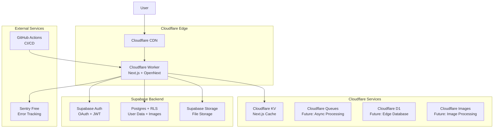

## 論理層構成

### レイヤーアーキテクチャ

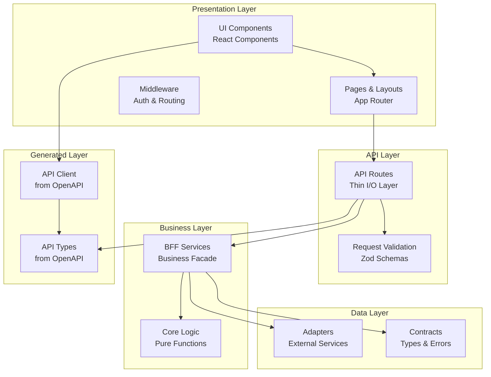

### 依存関係の方向

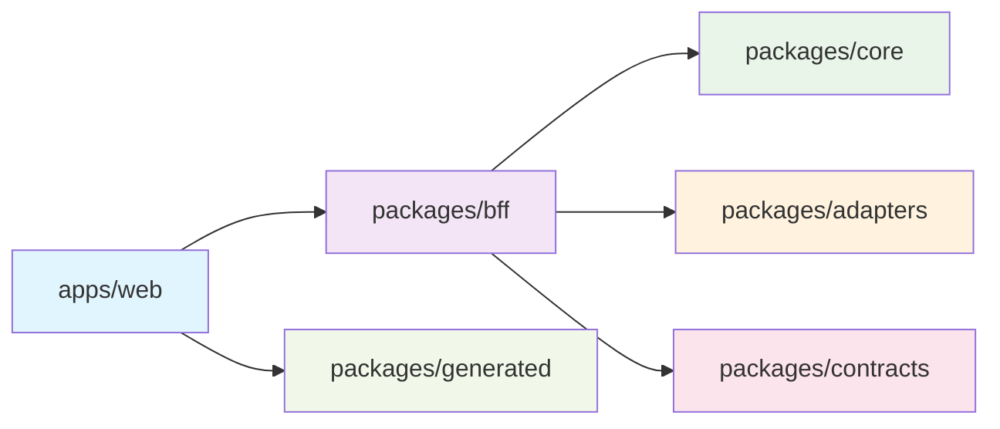

**依存方向の制約**:

- 上位層は下位層に依存可能
- 下位層は上位層に依存禁止
- 同一層内での循環依存禁止
- ESLintルールで自動検証

## 2モード切替アーキテクチャ

### モノリスモード（Monolith Mode）

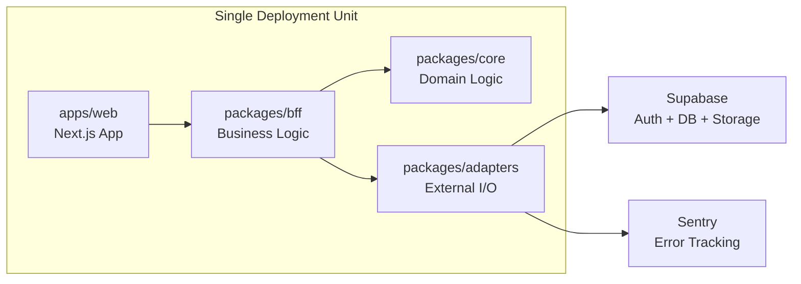

**特徴**:

- 単一デプロイメント単位
- 開発・テストが容易
- 初期開発に適している

### サービスモード（Service Mode）

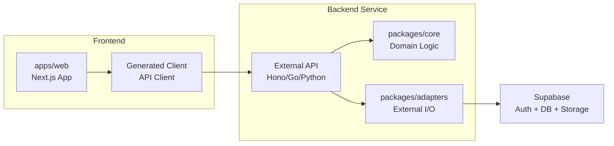

**特徴**:

- フロントエンドとバックエンドの分離
- 独立したスケーリング
- チーム分割に適している

### モード切替の実装

```typescript
// 環境変数による切替
const BACKEND_MODE = process.env.BACKEND_MODE; // 'monolith' | 'service'

// Factory Pattern による実装切替
export class ServiceFactory {
  static create(): Services {
    if (BACKEND_MODE === 'service') {
      return new ExternalServiceClient();
    }
    return new MonolithServices();
  }
}
```

## コンポーネント詳細設計

### 1. Presentation Layer（apps/web）

#### ページ構成

```
app/
├── page.tsx                 # トップページ（未認証）
├── home/
│   └── page.tsx            # ホームページ（認証必須）
├── health/
│   └── page.tsx            # ヘルスチェック（SSR）
├── api/
│   ├── healthz/route.ts    # Liveness Probe
│   ├── readyz/route.ts     # Readiness Probe
│   ├── diag/route.ts       # Diagnostics（認証必須）
│   ├── auth/
│   │   ├── login/route.ts  # OAuth開始
│   │   ├── callback/route.ts # OAuth コールバック
│   │   └── logout/route.ts # ログアウト
│   └── images/
│       └── route.ts        # 画像管理API
├── middleware.ts           # 認証・ルーティング制御
└── layout.tsx             # ルートレイアウト
```

#### Middleware設計

```typescript
// apps/web/src/middleware.ts
export function middleware(request: NextRequest) {
  const { pathname } = request.nextUrl;

  // TraceContext を作成（要件 13.4 準拠）
  const traceparent = request.headers.get('traceparent') || undefined;
  const requestContext = TraceContext.createRequestContext(traceparent);

  // Logger を初期化
  const logger = LoggerFactory.createDefault();

  try {
    const response = NextResponse.next();

    // レスポンスヘッダーにTraceContextを追加
    const traceparentHeader = TraceContext.generateTraceparent(
      requestContext.traceInfo
    );
    response.headers.set('traceparent', traceparentHeader);
    response.headers.set('x-request-id', requestContext.requestId);

    // 認証が必要なパスの定義
    const protectedPaths = ['/home', '/api/diag'];
    const isProtectedPath = protectedPaths.some((path) =>
      pathname.startsWith(path)
    );

    if (isProtectedPath) {
      const accessToken = request.cookies.get('sb-access-token')?.value;

      if (!accessToken) {
        const loginUrl = new URL('/auth/login', request.url);
        loginUrl.searchParams.set('redirect', pathname);
        return NextResponse.redirect(loginUrl);
      }
    }

    return response;
  } finally {
    TraceContext.clearRequestContext();
  }
}
```

### 2. Business Layer（packages/bff）

#### サービス設計

```typescript
// packages/bff/src/health/health-service.ts
export interface HealthService {
  checkLiveness(): Promise<LivenessResult>;
  checkReadiness(): Promise<ReadinessResult>;
  checkDiagnostics(): Promise<DiagnosticsResult>;
}

export class HealthServiceImpl implements HealthService {
  constructor(
    private supabaseAdapter: SupabaseAdapter,
    private storageAdapter: StorageAdapter,
    private logger: Logger,
    private metadata: SystemMetadata
  ) {}

  async checkReadiness(): Promise<ReadinessResult> {
    this.logger.info('Performing readiness check');

    const checks: HealthCheck[] = [];

    try {
      // Supabase接続チェック
      const supabaseCheck = await this.checkSupabase();
      checks.push(supabaseCheck);

      // Storage接続チェック
      const storageCheck = await this.checkStorage();
      checks.push(storageCheck);

      const result = createReadinessResult(checks, this.metadata);
      this.logger.info({ result }, 'Readiness check completed');
      return result;
    } catch (error) {
      this.logger.error({ error }, 'Readiness check failed');
      throw error;
    }
  }
}
```

### 3. Core Layer（packages/core）

#### ドメインモデル

```typescript
// packages/core/src/user/types.ts
export interface User {
  readonly id: string;
  readonly createdAt: Date;
  readonly updatedAt: Date;
  readonly lastLoginAt: Date;
}

// packages/core/src/user/update-last-login.ts
export function updateLastLogin(user: User): User {
  const now = new Date();
  return {
    ...user,
    lastLoginAt: now,
    updatedAt: now,
  };
}

// バリデーション関数
export function isValidUserId(id: string): boolean {
  return /^[0-9a-f]{8}-[0-9a-f]{4}-4[0-9a-f]{3}-[89ab][0-9a-f]{3}-[0-9a-f]{12}$/i.test(
    id
  );
}
```

### 4. Data Layer（packages/adapters）

#### アダプター設計

```typescript
// packages/adapters/src/supabase/supabase-adapter.ts
export class SupabaseAdapterImpl implements SupabaseAdapter {
  private client: SupabaseClient;
  private serviceClient?: SupabaseClient;
  private logger: Logger;

  constructor(config: SupabaseConfig, logger: Logger) {
    this.client = createClient(config.url, config.anonKey);
    if (config.serviceRoleKey) {
      this.serviceClient = createClient(config.url, config.serviceRoleKey);
    }
    this.logger = logger;
  }

  async ping(): Promise<boolean> {
    try {
      const { error } = await this.client
        .from('app_users')
        .select('id')
        .limit(1);

      return !error;
    } catch (error) {
      this.logger.error({ error }, 'Supabase ping failed');
      return false;
    }
  }

  async createUser(user: CreateUserRequest): Promise<User> {
    if (!this.serviceClient) {
      throw new Error('Service role key required for user creation');
    }

    const { data, error } = await this.serviceClient
      .from('app_users')
      .insert({
        id: user.id,
        created_at: new Date().toISOString(),
        updated_at: new Date().toISOString(),
        last_login_at: new Date().toISOString(),
      })
      .select()
      .single();

    if (error) {
      this.logger.error({ error }, 'Failed to create user');
      throw new Error(`Failed to create user: ${error.message}`);
    }

    return this.mapToUser(data);
  }
}
```

## データフロー

### 認証フロー

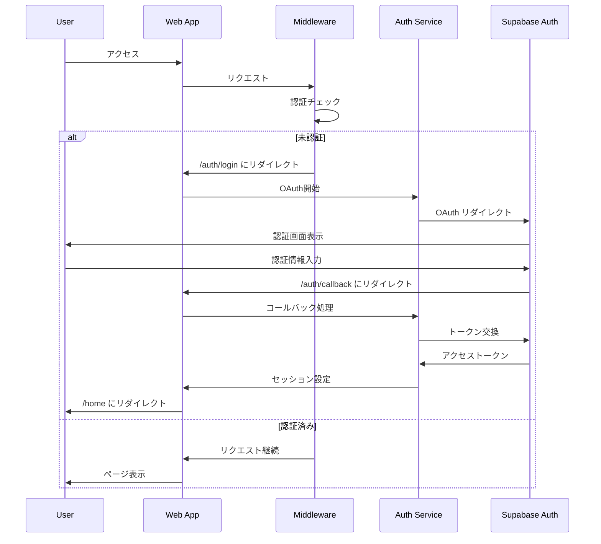

### API リクエストフロー

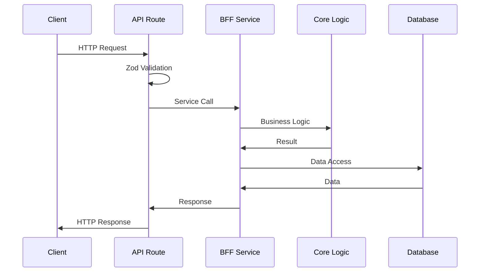

## セキュリティアーキテクチャ

### 認証・認可

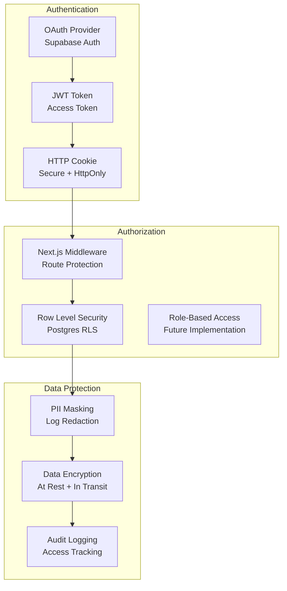

### セキュリティ制御

1. **認証レイヤー**
   - Supabase Auth による OAuth 認証
   - JWT トークンによるセッション管理
   - HttpOnly Cookie による XSS 対策

2. **認可レイヤー**
   - Next.js Middleware による ルート保護
   - Postgres RLS による データアクセス制御
   - ユーザー ID による リソース分離

3. **データ保護レイヤー**
   - ログの PII マスキング
   - 保存時・転送時の暗号化
   - アクセスログによる監査証跡

## パフォーマンスアーキテクチャ

### キャッシュ戦略

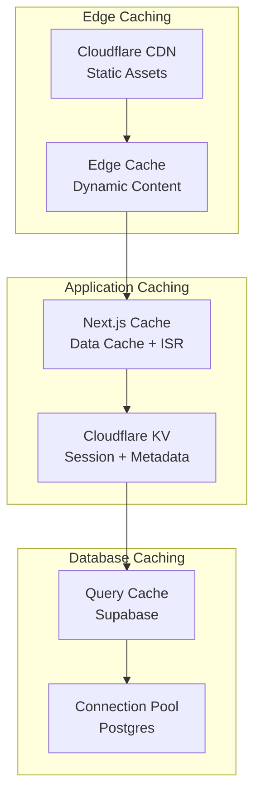

### パフォーマンス目標

- **API レスポンス**: p95 < 300ms
- **ページロード**: FCP < 1.5s, LCP < 2.5s
- **ビルド時間**: < 5分
- **デプロイ時間**: < 2分

## 監視・観測性アーキテクチャ

### ログ・メトリクス

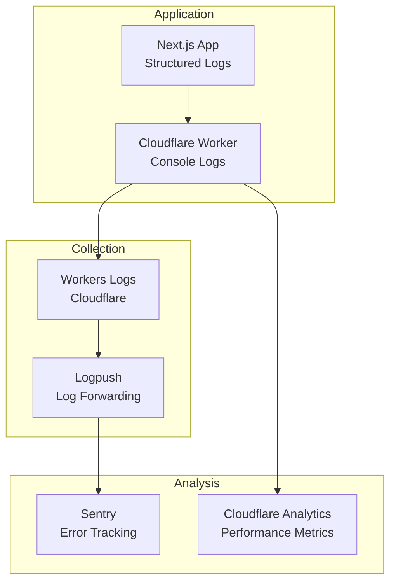

### TraceContext

```typescript
// W3C TraceContext 準拠
interface TraceContext {
  traceId: string; // 32文字の16進数
  spanId: string; // 16文字の16進数
  requestId: string; // UUID v4
}

// ヘッダー形式
// traceparent: 00-<trace-id>-<parent-id>-<trace-flags>
```

## 拡張性・将来性

### 段階的拡張計画

1. **Phase 1**: MVP実装（現在）
   - ヘルスチェック
   - 認証・認可
   - 画像管理

2. **Phase 2**: 機能拡張
   - ユーザープロファイル
   - 画像共有
   - 通知機能

3. **Phase 3**: スケール対応
   - マイクロサービス分離
   - 非同期処理（Queues）
   - 高度な画像処理（Images）

### アーキテクチャ進化

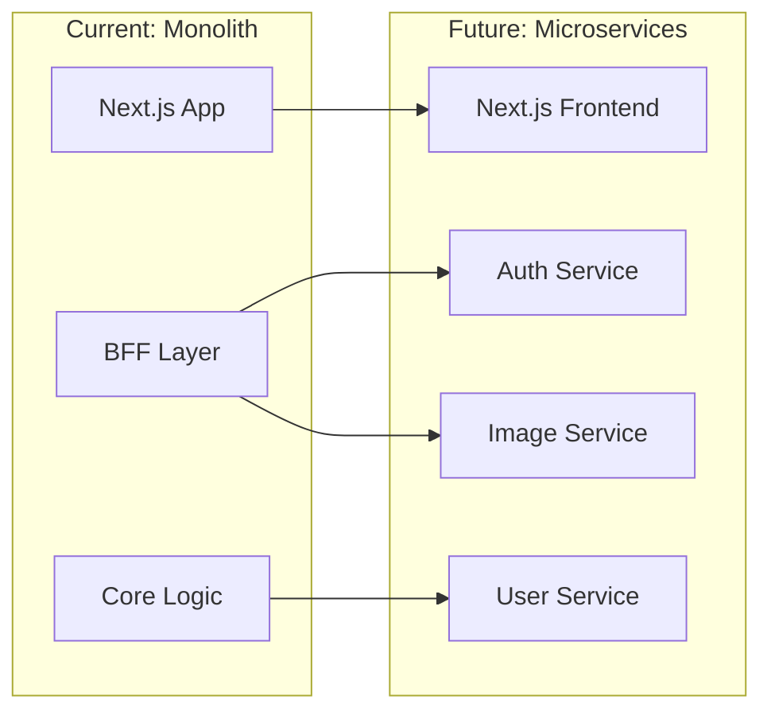

## 技術的制約・前提条件

### Cloudflare Workers 制約

1. **ランタイム制限**
   - CPU時間: 10ms（無料）/ 50ms（有料）
   - メモリ: 128MB
   - リクエストサイズ: 100MB

2. **互換性要件**
   - `compatibility_date >= 2024-09-23`
   - `nodejs_compat` フラグ必須
   - Edge Runtime 使用禁止

3. **ストレージ制限**
   - KV: 1GB（無料）/ 無制限（有料）
   - R2: 10GB（無料）/ 従量課金（有料）

### Next.js 制約

1. **OpenNext 対応**
   - App Router 必須
   - Server Components 推奨
   - Edge Runtime 使用禁止

2. **ビルド制約**
   - 静的最適化の制限
   - 動的インポートの制限

## まとめ

Template Gammaのアーキテクチャは、以下の特徴を持ちます：

1. **段階的拡張**: MVPから始めて徐々に機能を追加
2. **型安全性**: OpenAPI-Firstによる契約駆動開発
3. **層分離**: 明確な責任分離と一方向依存
4. **観測性**: 構造化ログと分散トレーシング
5. **セキュリティ**: 多層防御とPII保護
6. **パフォーマンス**: エッジコンピューティングとキャッシュ戦略
7. **拡張性**: モノリスからマイクロサービスへの進化パス

このアーキテクチャにより、開発効率と運用品質を両立し、将来の成長に対応できる基盤を提供します。
