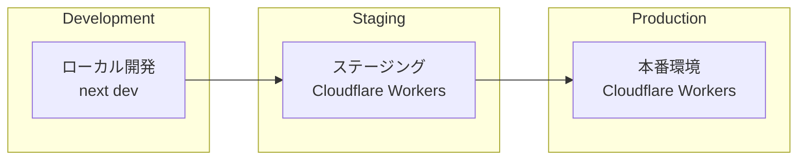

# デプロイメントガイド

## 概要

Template Gammaプロジェクトのデプロイメントについて説明します。OpenNextを使用してNext.jsアプリケーションをCloudflare Workers上にデプロイし、効率的で拡張性の高いWebアプリケーションを実現します。

## デプロイメント戦略

### 環境構成



### デプロイフロー

1. **開発環境**: Windows上での`next dev`
2. **ビルド**: Linux環境での`@opennextjs/cloudflare build`
3. **デプロイ**: Wranglerによる自動デプロイ
4. **検証**: ヘルスチェックとスモークテスト

## OpenNext設定

### 前提条件

#### 必須要件

- **Node.js**: 22.x
- **Next.js**: 15.5.2以上
- **App Router**: 必須（Pages Routerは非対応）
- **Runtime**: Node.js（Edge Runtime使用禁止）

#### 互換性設定

```json
// wrangler.jsonc
{
  "compatibility_date": "2025-09-23",
  "compatibility_flags": ["nodejs_compat", "nodejs_compat_populate_process_env"]
}
```

### OpenNext設定ファイル

```typescript
// open-next.config.ts
import type { OpenNextConfig } from '@opennextjs/cloudflare';

const config: OpenNextConfig = {
  // Cloudflare Workers 用の設定
  cloudflare: {
    // R2 を使用したキャッシュ設定（推奨）
    cache: {
      type: 'r2',
      bucketName: 'template-gamma-cache',
    },

    // 環境変数の設定
    env: {
      // 本番環境で必要な環境変数
      NODE_ENV: 'production',
      BACKEND_MODE: 'monolith',
    },

    // Workers の互換性設定
    compatibility: {
      date: '2025-09-23',
      flags: ['nodejs_compat'],
    },
  },

  // ビルド設定
  build: {
    // 静的アセットの最適化
    minify: true,

    // バンドルサイズの最適化
    splitting: true,
  },

  // 実行時設定
  runtime: {
    // Node.js ランタイムを使用（Edge ランタイムは非対応）
    type: 'nodejs',
  },
};

export default config;
```

### ビルドプロセス

```bash
# 1. Next.jsビルド
pnpm build

# 2. OpenNext変換
pnpm exec @opennextjs/cloudflare build

# 3. 生成物確認
ls -la .open-next/
```

**生成されるファイル**:

- `.open-next/worker.js`: Cloudflare Worker用のエントリーポイント
- `.open-next/assets/`: 静的アセット
- `.open-next/server/`: サーバーサイドコード

## Cloudflare Workers設定

### Wrangler設定

```json
// wrangler.jsonc
{
  "$schema": "node_modules/wrangler/config-schema.json",
  "name": "template-gamma",
  "main": ".open-next/worker.js",
  "assets": {
    "directory": ".open-next/assets",
    "binding": "ASSETS"
  },
  "compatibility_date": "2025-09-23",
  "compatibility_flags": ["nodejs_compat"],
  "r2_buckets": [
    {
      "binding": "NEXT_CACHE_R2",
      "bucket_name": "template-gamma-cache"
    }
  ],
  "vars": {
    "NODE_ENV": "production",
    "BACKEND_MODE": "monolith",
    "APP_VERSION": "1.0.0",
    "GIT_COMMIT": "unknown",
    "BUILD_TIME": "2024-01-01T00:00:00Z"
  }
}
```

### R2バケットの作成

```bash
# R2バケットの作成
wrangler r2 bucket create template-gamma-cache

# バケット一覧の確認
wrangler r2 bucket list

# 結果をwrangler.jsoncに設定済み
```

### KVネームスペース（将来対応）

KVキャッシュを使用する場合の設定：

```bash
# 本番用KVネームスペース
wrangler kv:namespace create "NEXT_CACHE_WORKERS_KV"

# プレビュー用KVネームスペース
wrangler kv:namespace create "NEXT_CACHE_WORKERS_KV" --preview
```

### R2バケット設定（将来対応）

```json
// wrangler.jsonc（R2版）
{
  "r2_buckets": [
    {
      "binding": "NEXT_CACHE_R2",
      "bucket_name": "template-gamma-cache"
    }
  ]
}
```

## 環境変数管理

### 開発環境（.dev.vars）

```bash
# .dev.vars（ローカル開発用）
SUPABASE_URL=https://your-project.supabase.co
SUPABASE_ANON_KEY=your-anon-key
SUPABASE_SERVICE_ROLE_KEY=your-service-role-key
SENTRY_DSN=your-sentry-dsn
LOG_LEVEL=debug
BACKEND_MODE=monolith
```

### 本番環境（Secrets）

```bash
# 機密情報はWrangler Secretsで管理
wrangler secret put SUPABASE_SERVICE_ROLE_KEY
wrangler secret put SENTRY_DSN

# 非機密情報はwrangler.jsoncのvarsで管理
```

### 環境変数の優先順位

1. **Wrangler Secrets**（最優先）
2. **wrangler.jsonc vars**
3. **process.env**（フォールバック）

```typescript
// 環境変数の取得例
const getEnvVar = (key: string): string => {
  // Cloudflare Workers環境
  if (typeof globalThis !== 'undefined' && globalThis.env) {
    return globalThis.env[key];
  }

  // Node.js環境（フォールバック）
  return process.env[key] || '';
};
```

## デプロイコマンド

### ローカルプレビュー

```bash
# OpenNextビルド
pnpm opennext:build

# ローカルWorkersランタイムでプレビュー
pnpm opennext:preview

# ブラウザで確認
# http://localhost:8787
```

### デプロイ前検証

```bash
# 設定の検証（ドライラン）
pnpm opennext:deploy:dry

# または直接実行
wrangler deploy --dry-run
```

### 実際のデプロイ

```bash
# ステージング環境
wrangler deploy --env staging

# 本番環境
wrangler deploy --env production

# または環境指定なし（デフォルト）
wrangler deploy
```

## CI/CDパイプライン

### GitHub Actions設定

```yaml
# .github/workflows/deploy.yml
name: Deploy

on:
  push:
    branches: [main, develop]
  release:
    types: [published]

jobs:
  deploy:
    runs-on: ubuntu-latest
    steps:
      - uses: actions/checkout@v4

      - name: Setup Node.js
        uses: actions/setup-node@v4
        with:
          node-version: '22'

      - name: Install dependencies
        run: corepack enable && pnpm install --frozen-lockfile

      - name: Run tests
        run: pnpm test:all

      - name: Build application
        run: pnpm build

      - name: Build with OpenNext
        run: pnpm exec @opennextjs/cloudflare build

      - name: Deploy to Cloudflare Workers
        uses: cloudflare/wrangler-action@v3
        with:
          apiToken: ${{ secrets.CLOUDFLARE_API_TOKEN }}
          accountId: ${{ secrets.CLOUDFLARE_ACCOUNT_ID }}
          command: deploy --env ${{ github.ref == 'refs/heads/main' && 'production' || 'staging' }}
```

### 環境別デプロイ

```yaml
# 環境別設定
environments:
  staging:
    trigger: develop ブランチへのPush
    wrangler_env: staging
    secrets:
      - SUPABASE_SERVICE_ROLE_KEY_STAGING
      - SENTRY_DSN_STAGING

  production:
    trigger: main ブランチへのPush
    wrangler_env: production
    secrets:
      - SUPABASE_SERVICE_ROLE_KEY_PROD
      - SENTRY_DSN_PROD
```

## 環境別設定

### ステージング環境

```json
// wrangler.jsonc
{
  "env": {
    "staging": {
      "name": "template-gamma-staging",
      "vars": {
        "NODE_ENV": "staging",
        "LOG_LEVEL": "debug"
      },
      "kv_namespaces": [
        {
          "binding": "NEXT_CACHE_WORKERS_KV",
          "id": "staging-kv-namespace-id"
        }
      ]
    }
  }
}
```

### 本番環境

```json
// wrangler.jsonc
{
  "env": {
    "production": {
      "name": "template-gamma",
      "vars": {
        "NODE_ENV": "production",
        "LOG_LEVEL": "info"
      },
      "kv_namespaces": [
        {
          "binding": "NEXT_CACHE_WORKERS_KV",
          "id": "production-kv-namespace-id"
        }
      ]
    }
  }
}
```

## ドメイン設定

### カスタムドメインの設定

```bash
# ドメインの追加
wrangler custom-domains add template-gamma.com

# SSL証明書の確認
wrangler custom-domains list
```

### DNS設定

```
# Cloudflare DNS設定
template-gamma.com    CNAME   template-gamma.workers.dev
www.template-gamma.com CNAME  template-gamma.workers.dev
```

### リダイレクト設定

```typescript
// middleware.ts でのリダイレクト
export function middleware(request: NextRequest) {
  const { hostname } = request.nextUrl;

  // www -> non-www リダイレクト
  if (hostname.startsWith('www.')) {
    const url = request.nextUrl.clone();
    url.hostname = hostname.replace('www.', '');
    return NextResponse.redirect(url, 301);
  }

  return NextResponse.next();
}
```

## パフォーマンス最適化

### キャッシュ設定

```typescript
// next.config.js
/** @type {import('next').NextConfig} */
const nextConfig = {
  // 静的アセットのキャッシュ
  async headers() {
    return [
      {
        source: '/_next/static/:path*',
        headers: [
          {
            key: 'Cache-Control',
            value: 'public, max-age=31536000, immutable',
          },
        ],
      },
    ];
  },

  // 画像最適化
  images: {
    domains: ['your-project.supabase.co'],
    formats: ['image/webp', 'image/avif'],
  },
};

module.exports = nextConfig;
```

### ISR（Incremental Static Regeneration）

```typescript
// app/health/page.tsx
export const revalidate = 60; // 60秒でキャッシュ更新

export default async function HealthPage() {
  const healthData = await getHealthStatus();

  return (
    <div>
      <h1>Health Status</h1>
      <pre>{JSON.stringify(healthData, null, 2)}</pre>
    </div>
  );
}
```

### バンドルサイズ最適化

```bash
# バンドルサイズ分析
pnpm build
pnpm exec @next/bundle-analyzer

# 不要な依存関係の除去
pnpm depcheck
```

## 監視・ログ

### Cloudflare Analytics

```typescript
// app/layout.tsx
export default function RootLayout({
  children,
}: {
  children: React.ReactNode;
}) {
  return (
    <html lang="ja">
      <head>
        {/* Cloudflare Web Analytics */}
        <script
          defer
          src="https://static.cloudflareinsights.com/beacon.min.js"
          data-cf-beacon='{"token": "your-analytics-token"}'
        />
      </head>
      <body>{children}</body>
    </html>
  );
}
```

### Workers Logs

```bash
# リアルタイムログ監視
wrangler tail

# 特定期間のログ取得
wrangler tail --since 1h

# フィルタリング
wrangler tail --grep "ERROR"
```

### Sentry統合

```typescript
// packages/adapters/sentry.ts
import * as Sentry from '@sentry/cloudflare';

export function initSentry(env: any) {
  Sentry.init({
    dsn: env.SENTRY_DSN,
    environment: env.NODE_ENV,
    release: env.APP_VERSION,

    // エラー収集のみ（APM無効）
    tracesSampleRate: 0,

    // PII除去
    beforeSend(event) {
      if (event.request?.headers) {
        delete event.request.headers['authorization'];
        delete event.request.headers['cookie'];
      }
      return event;
    },
  });
}
```

## セキュリティ

### セキュリティヘッダー

```typescript
// middleware.ts
export function middleware(request: NextRequest) {
  const response = NextResponse.next();

  // セキュリティヘッダーの設定
  response.headers.set('X-Frame-Options', 'DENY');
  response.headers.set('X-Content-Type-Options', 'nosniff');
  response.headers.set('Referrer-Policy', 'strict-origin-when-cross-origin');
  response.headers.set(
    'Content-Security-Policy',
    "default-src 'self'; script-src 'self' 'unsafe-inline'; style-src 'self' 'unsafe-inline';"
  );

  return response;
}
```

### Secrets管理

```bash
# Secretsの設定
wrangler secret put SUPABASE_SERVICE_ROLE_KEY
wrangler secret put SENTRY_DSN

# Secretsの一覧表示
wrangler secret list

# Secretsの削除
wrangler secret delete SECRET_NAME
```

## トラブルシューティング

### よくある問題と解決方法

#### 1. OpenNextビルドエラー

```bash
# 問題: ビルドが失敗する
# 解決方法: キャッシュクリア
rm -rf .next .open-next node_modules/.cache
pnpm build
pnpm opennext:build
```

#### 2. Runtime エラー

```bash
# 問題: Edge Runtime使用エラー
# 解決方法: runtime指定を削除
# ❌ export const runtime = 'edge';
# ✅ runtime指定なし（Node.js使用）
```

#### 3. 環境変数が取得できない

```typescript
// 問題: process.envが空
// 解決方法: env バインディング使用
const getConfig = (env: any) => ({
  supabaseUrl: env.SUPABASE_URL || process.env.SUPABASE_URL,
  logLevel: env.LOG_LEVEL || process.env.LOG_LEVEL || 'info',
});
```

#### 4. KVキャッシュエラー

```bash
# 問題: KVネームスペースが見つからない
# 解決方法: ネームスペースの作成・設定確認
wrangler kv:namespace list
wrangler kv:namespace create "NEXT_CACHE_WORKERS_KV"
```

### デバッグ手順

#### 1. ローカルデバッグ

```bash
# 開発サーバーでの確認
pnpm dev

# OpenNextローカルプレビュー
pnpm opennext:preview

# ログ出力の確認
wrangler tail --local
```

#### 2. 本番デバッグ

```bash
# 本番ログの確認
wrangler tail

# ヘルスチェック
curl https://template-gamma.workers.dev/api/healthz

# 設定の確認
wrangler whoami
wrangler kv:namespace list
```

## パフォーマンス監視

### Core Web Vitals

```typescript
// app/layout.tsx
'use client';

import { useReportWebVitals } from 'next/web-vitals';

export default function Layout({ children }: { children: React.ReactNode }) {
  useReportWebVitals((metric) => {
    // Cloudflare Analyticsに送信
    if (typeof window !== 'undefined' && window.gtag) {
      window.gtag('event', metric.name, {
        value: Math.round(metric.value),
        event_label: metric.id,
        non_interaction: true,
      });
    }
  });

  return <html><body>{children}</body></html>;
}
```

### 目標値

- **FCP (First Contentful Paint)**: < 1.5秒
- **LCP (Largest Contentful Paint)**: < 2.5秒
- **CLS (Cumulative Layout Shift)**: < 0.1
- **FID (First Input Delay)**: < 100ms

## 災害復旧

### バックアップ戦略

1. **コード**: Gitリポジトリ
2. **設定**: wrangler.jsonc + Secrets
3. **データ**: Supabaseバックアップ
4. **KVデータ**: 定期エクスポート

### ロールバック手順

```bash
# 前のバージョンにロールバック
wrangler rollback

# 特定のデプロイメントにロールバック
wrangler rollback --deployment-id <deployment-id>

# 緊急時の手動デプロイ
git checkout <previous-commit>
pnpm build && pnpm opennext:build
wrangler deploy
```

## コスト最適化

### Cloudflare Workers料金

- **無料プラン**: 100,000リクエスト/日
- **有料プラン**: $5/月 + $0.50/100万リクエスト

### 最適化のポイント

1. **キャッシュ活用**: 静的コンテンツのCDNキャッシュ
2. **ISR使用**: 動的コンテンツの効率的な更新
3. **バンドルサイズ**: 不要なライブラリの除去
4. **画像最適化**: WebP/AVIF形式の使用

## まとめ

Template Gammaのデプロイメントは以下の特徴を持ちます：

- **効率性**: OpenNextによる最適化されたビルド
- **拡張性**: Cloudflare Workersのグローバル配信
- **信頼性**: 自動化されたCI/CDパイプライン
- **監視性**: 包括的なログとメトリクス
- **セキュリティ**: 適切なSecrets管理とセキュリティヘッダー
- **パフォーマンス**: エッジコンピューティングとキャッシュ戦略

適切なデプロイメント戦略により、高性能で信頼性の高いWebアプリケーションの運用が可能になります。
